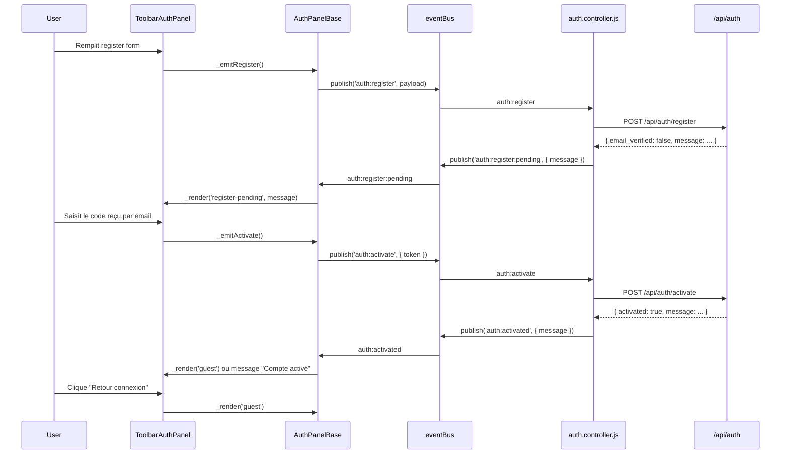

## Détail de l'interaction : **ToolbarAuthPanel** ↔ **Bus** ↔ **uiapp.js**

Voici une analyse complète de l'architecture d'authentification et de l'orchestration du bus d'événements :

---

### 🏗️ **Architecture générale**

Code

```
┌─────────────────────────────────────────────────────────────┐
│ uiapp.js : boot()                                           │
├─────────────────────────────────────────────────────────────┤
│ 1. initAuthController()                                     │
│    ↓                                                         │
│    Crée des souscriptions au bus (auth:check, auth:login..)│
│                                                              │
│ 2. new ToolbarAuthPanel().init()                            │
│    ↓                                                         │
│    Se branche aussi au bus (écoute les mêmes événements)   │
│                                                              │
│ 3. bus.publish('auth:check')                                │
│    ↓ Déclenche toute la chaîne                              │
└─────────────────────────────────────────────────────────────┘
```

---

### 🔌 **Qui fait quoi : ToolbarAuthPanel vs AuthPanelBase**

|Aspect|**AuthPanelBase**|**ToolbarAuthPanel**|
|---|---|---|
|**Rôle**|Logique + Bindings|UI seulement|
|**Hérite de**|PanelBase|AuthPanelBase|
|**Sélecteur**|`.header-auth` (toolbar)|`.header-auth` (toolbar)|
|`_buildLoading()`|❌ Doit être implémenté|✅ Spinner FA animé|
|`_buildGuestForm()`|❌ Abstract|✅ Email + Password + Login btn + Register btn|
|`_buildRegisterForm()`|❌ Abstract|✅ 8 champs (username, email, 2× pwd, tel, mobile, persid, orgid)|
|`_buildRegisterPending()`|✅ Default minimal|✅ Surcharge : juste un message|
|`_buildRegisterToolbar()`|✅ Default simple|✅ Surcharge : bouton "Retour connexion" stylisé|
|`_buildUserBar(user)`|❌ Abstract|✅ Avatar + Username + Board + Admin + Logout|
|**Bindings**|Tous les event listeners|(hérité, aucun ajout)|
|**Appels API**|❌ Aucun|❌ Aucun|
|**Store/Import**|`import { bus }` uniquement|`import { bus, create }`|

**Clé** : **AuthPanelBase est la "mécanique"**, **ToolbarAuthPanel en est la "peau"**.

---

### 🎯 **Les 4 états du rendu (_render)**

JavaScript

```
_render(state, payload = null)
```

|État|Qui le déclenche|Où ?|Affichage|
|---|---|---|---|
|**`'loading'`**|auth:loading (true)|`.header-auth`|Spinner FA|
|**`'guest'`**|auth:guest, auth:check échoue|`.header-auth`|Formulaire login (email + pwd + 2 btns)|
|**`'error'`**|auth:error (message)|`.header-auth`|Formulaire login + message d'erreur|
|**`'register'`**|btn "Inscription" cliqué ou auth:show-register|`.header-auth` + `#user-board-body`|Mini toolbar + formulaire dans board|
|**`'register-pending'`**|auth:register:pending (message)|`#user-board-body`|Message seul (en attente de validation email)|
|**`'user'`**|auth:success|`.header-auth`|Avatar + username + 2-3 btns (Board, Admin?, Logout)|

---

### 🚦 **Cycle complet : exemple du login**

Code

```
Utilisateur tape email/pwd et clique

    ↓
[.header-auth .auth-submit] click event

    ↓
_bindForm() → _emitLogin()

    ↓
bus.publish('auth:login', { email, password })

    ↓ (écoute dans auth.controller.js)
auth:login handler → fetchLogin(API) 

    ↓ Succès
bus.publish('auth:success', { user, token })

    ↓ (écoute dans AuthPanelBase._subscribeBus)
this._user = user
this._render('user')

    ↓
ToolbarAuthPanel._buildUserBar(user) → éléments DOM

    ↓
_bindLogout() / _bindUser() / _bindAdmin()

    ✓ Affichage mis à jour
```

---

### 🔄 **Le rôle du bus dans uiapp.js**

Depuis **boot()** et **window.onload** :

JavaScript

```
boot() {
    initAuthController()           // Crée 5+ souscriptions au bus
    new ToolbarAuthPanel().init()  // Crée 5 souscriptions au bus
    
    bus.subscribe('auth:success', () => (
        mountApplication(),        // Lance l'app réelle
        mountUserBoard(authStore.user)  // Affiche le profil dans le board
    ))
    bus.subscribe('auth:guest', () => noAuth())  // App cachée
    bus.subscribe('board:user', () => { 
        switchPanel(PANEL_USER)    // Bascule vers le panel utilisateur
    })
    
    bus.publish('auth:check')  // Lance la vérification initiale
}
```

**Points clés** :

- Le bus est la **seule source d'orchestration** entre les modules
- `uiapp.js` écoute `auth:success` et décide d'afficher l'app + le board
- `ToolbarAuthPanel` écoute aussi `auth:success` et met à jour la toolbar
- Aucun appel API direct depuis `uiapp.js` — tout passe par `auth.controller.js`

---

### ⚠️ **Concernant l'activation de compte (TODO)**

D'après votre `doc/notes/2026-10-03.md`, il faut ajouter :

**1. Dans `auth.controller.js`** (ligne 5) :

JavaScript

```
import { fetchActivate } from './auth.service.js'  // À créer

bus.subscribe('auth:activate', async ({ token }) => {
    // Appel API : POST /api/auth/activate?token=...
    const data = await fetchActivate(token)
    bus.publish('auth:activated', { user: data.user })
    // PAS de auth:success après activation
})
```

**2. Dans `AuthPanelBase._buildRegisterPending()`** (actuellement juste un message) :

- Ajouter un formulaire pour entrer le code reçu par email
- Bouton qui publie `bus.publish('auth:activate', { token })`
- Écouter `auth:activated` → message "Compte activé. Vous pouvez maintenant vous connecter."
- Bouton "Retour au login"

**3. Classe override** : `ToolbarAuthPanel._buildRegisterPending()` pour enrichir l'UI du message d'attente.

---

### 📊 **Diagramme du flux complet**

Code

```
┌──────────────────────────────────────────────────────────────────┐
│                    uiapp.js : window.onload                      │
└──────────────────────────────────────────────────────────────────┘
                           ↓
          ┌────────────────┴────────────────┐
          ↓                                  ↓
    initAuthController()          new ToolbarAuthPanel().init()
  (auth.controller.js)              (AuthPanelBase._subscribeBus)
          ↓                                  ↓
    5 bus.subscribe()            5 bus.subscribe()
    [auth:check, auth:login,     [auth:loading, auth:success,
     auth:register, ...]          auth:guest, auth:error, ...]
          ↓                                  ↓
    ┌─────┴──────────────────────────────┬─┘
    │       bus.publish('auth:check')     │
    └─────┬──────────────────────────────┬─┘
          ↓                              ↓
    fetchMe(token) API         _render('guest') ou _render('user')
    sessionStorage check
          ↓                              ↓
    auth:guest  ─────────────→  ToolbarAuthPanel affiche login
         ou
    auth:success ──────────→  ToolbarAuthPanel affiche user bar
          ↓                              ↓
    mountApplication()         switchPanel(PANEL_USER)
    mountUserBoard(user)       renderUserCard(user)
```

---

### 🎓 **Résumé des responsabilités**

| **Module**           | **Responsabilité**                                                                                                  |
| -------------------- | ------------------------------------------------------------------------------------------------------------------- |
| `uiapp.js`           | **Orchestration** : lancer le boot, abonner l'app aux événements majeurs (auth:success, auth:guest)                 |
| `auth.controller.js` | **Logique métier** : écoute les demandes d'action (auth:login), appelle l'API, publie les résultats                 |
| `AuthPanelBase`      | **Mécanique d'UI** : souscrit au bus, dispatch aux sous-classes via `_render()`, gère les bindings d'événements DOM |
| `ToolbarAuthPanel`   | **Peau d'UI** : implémente les 4 constructeurs `_build*()`, définit le look dans la toolbar `.header-auth`          |
| `eventBus.js`        | **Messager** : pub/sub synchrone entre tous les modules                                                             |

---

mettre en place pour l’activation de compte, en continuant depuis l’architecture déjà en place. 
- implémenter la chaîne d'activation.
- détailler le flux complet pour `auth:activate`
- modifier `AuthPanelBase._buildRegisterPending()`


Le point central est celui-ci :

- `auth:register` publie une demande d’inscription
- le backend répond avec un état “pending activation”
- l’UI affiche un “register-pending”
- l’utilisateur reçoit un code par email
- il passe en mode “activation”
- `auth:activate` publie le code au bus
- le controller appelle `fetchActivate(token)`
- le bus publie `auth:activated`
- l’UI affiche “Compte activé. Vous pouvez maintenant vous connecter.”
- puis on revient au formulaire login

---

1. Le flux complet idéal

Mermaid



---

2. Ce que le bus doit exposer

La logique d’activation doit être totalement découplée de l’UI. Cela signifie :

- l’UI ne sait pas appeler le backend
- l’UI ne sait pas si l’activation est réussie
- l’UI se contente de publier des événements et d’écouter des événements

Les événements à ajouter sont :

- `auth:activate`
- `auth:activated`
- `auth:register:pending` : déjà présent
- `auth:show-register` : déjà présent
- `auth:guest` : déjà présent

La règle clé :

- Le bus publie l’intention
- le controller exécute l’action API
- le bus publie le résultat

---

3. Édition de `auth.controller.js`

Le correctif principal est ici :

public/assets/js/features/auth/auth.controller.js

```
import { bus } from '../../core/eventBus.js'
import { authStore } from './auth.store.js'
import {
  fetchLogin,
  fetchMe,
  fetchLogout,
```

---

4. Implémentation de `fetchActivate()` dans `auth.service.js`

Le service ne fait qu’appeler l’API. C’est ici que l’on précise le format de payload.

public/assets/js/features/auth/auth.service.js

```
const API = '/api/auth'

export async function fetchRegister(payload) {
  const res = await fetch(`${API}/register`, {
    method: 'POST',
    headers: { 'Content-Type': 'application/json' },
```

Important :

- Le backend attend probablement un token, pas “email + code”
- Si le token est un jeton de validation temporaire, il est mieux nommé `token`
- Le code affiché dans l’UI est généralement la valeur exacte que l’API accepte pour l’activation

---

5. La vraie modification dans `AuthPanelBase`

Le point important est que le mode “register pending” ne doit plus être un simple message statique. Il doit devenir une petite interface d’activation.

Le point d’entrée est dans le rendu :

public/assets/js/ui/workbench/core/AuthPanelBase.jsv1

```
_render(state, payload = null)
{
    if (!this._target) return

    clear(this._target)

```

Et il faut ajouter le binding d’activation :

public/assets/js/ui/workbench/core/AuthPanelBase.jsv2

```
_bindActivation()
{
    const body = this._boardBody()
    if (!body) return

    body.querySelector('.auth-activate-submit')
```

Et la méthode d’émission :

public/assets/js/ui/workbench/core/AuthPanelBase.jsv3

```
_emitActivate()
{
    const root = this._boardBody() ?? this._target
    const token = root.querySelector('[name="activation_token"]')?.value?.trim()

    if (!token) {
```

---

6. Le vrai changement côté `ToolbarAuthPanel`

Actuellement, `_buildRegisterPending()` fait juste :

JavaScript

```
_buildRegisterPending(message)
{
    const wrap = create('div', { class: 'auth-pending' })
    wrap.appendChild(create('p', { class: 'auth-success', text: message ?? 'Vérifiez votre email.' }))
    return wrap
}
```

Il faut le transformer en :

public/assets/js/ui/workbench/auth/ToolbarAuthPanel.js

```
_buildRegisterPending(message)
{
    const wrap = create('div', { class: 'auth-pending' })

    const info = create('p', {
        class: 'auth-success',
```

Et il faut aussi que l’UI réattache le click quand le DOM est monté :

Dans `AuthPanelBase._mountRegisterPending()`, il faut faire :

JavaScript

```
_mountRegisterPending(message)
{
    const body = this._boardBody()
    if (!body) return

    clear(body)
    body.appendChild(this._buildRegisterPending(message))
    this._bindActivation()
    this._bindShowGuest()
}
```

---

7. Le message de succès après activation

Quand on reçoit :

JavaScript

```
bus.publish('auth:activated', {
  message: 'Compte activé. Vous pouvez maintenant vous connecter.'
})
```

alors l’UI doit afficher ça proprement.

Dans `AuthPanelBase._subscribeBus`, il faut ajouter :

JavaScript

```
this._onActivated = ({ message }) => {
    this._clearBoardBody()
    const wrap = document.createElement('div')
    wrap.className = 'auth-pending'
    wrap.appendChild(create('p', { class: 'auth-success', text: message }))
    const body = this._boardBody()
    if (body) {
      clear(body)
      body.appendChild(wrap)
    }
    this._target.appendChild(this._buildRegisterToolbar())
    this._bindShowGuest()
}
```

Et dans `bus.subscribe` :

JavaScript

```
bus.subscribe('auth:activated', this._onActivated)
```

---

8. Pourquoi il ne faut pas publier `auth:success` après activation

C’est une règle importante :

- `auth:success` = “l’utilisateur est maintenant connecté et authentifié”
- `auth:activated` = “le compte a été validé ; il n’est pas encore connecté”

Donc :

- après activation, on ne crée pas de session
- on ne persiste pas `authStore.user`
- on ne publie pas `auth:success`
- on publie juste `auth:activated`

Cela évite que l’application pense que l’utilisateur est connecté alors que la connexion réelle n’a pas été faite.

---

9. Ce que cela change dans `uiapp.js`

Dans `uiapp.js`, on a déjà :

JavaScript

```
bus.subscribe('auth:success', () => (
  mountApplication(),
  console.log(authStore.user),
  mountUserBoard(authStore.user)
))
```

Il faut ajouter un listener dédié :

JavaScript

```
bus.subscribe('auth:activated', ({ message }) => {
  console.log('[auth]', message)
  // on reste en mode guest
  // on peut afficher le formulaire login
})
```

Et surtout, il faut ne pas fusionner `auth:activated` avec `auth:success`.

L’UX attendue :

- après inscription → pending activation
- après activation → message “Compte activé”
- ensuite retour au login
- ensuite login normal

---

10. L’ordre exact des événements

Voici la séquence à suivre en production:

Text

```
auth:register
  -> fetchRegister()
  -> auth:register:pending

auth:activate
  -> fetchActivate(token)
  -> auth:activated

auth:guest
  -> _render('guest')   // nécessaire pour revenir au login
```

Donc, sur l’UI :

- pas de `auth:success` après `auth:activate`
- pas de board user pour un compte non connecté
- retour à l’état guest au moment où le message de succès est affiché

---

11. Le point “client_profil_*” dans le commentaire

Oui, tu as raison : il faut éventuellement nettoyer les anciennes références `client_profil_*` dans le commentaire de `auth:register`.

Dans `auth.controller.js`, le commentaire actuel dit :

JavaScript

```
// {
//   shield_username, shield_email, shield_password,
//   client_profil_tel?, client_profil_mobile?,
//   client_profil_persid?, client_profil_orgid?
// }
```

C’est du legacy. Il faut le remplacer par :

JavaScript

```
// Payload attendu pour l’inscription :
// {
//   shield_username,
//   shield_email,
//   shield_password,
//   tel?, mobile?, persid?, orgid?
// }
```

Ou, si l’API backend attend encore les champs `client_profil_*`, alors garder ceux-ci, mais il faut éviter qu’ils soient présentés comme le contrat actuel si l’API a migré vers une représentation plus simple.

---

12. Verdict final

Le schéma correct est :

- `auth:register` → “inscription”
- `auth:register:pending` → “en attente d’activation”
- `auth:activate` → “vérifier le code”
- `auth:activated` → “activation validée”
- `auth:guest` → “retour au formulaire connexion”

et surtout :

- `auth:success` reste réservé au login réel, pas à l’activation

---

Si tu veux, je peux maintenant te donner le patch complet exact, prêt à copier-coller, sur :

- `public/assets/js/features/auth/auth.controller.js`
- `public/assets/js/features/auth/auth.service.js`
- `public/assets/js/ui/workbench/core/AuthPanelBase.js`
- `public/assets/js/ui/workbench/auth/ToolbarAuthPanel.js`

avec le code final exact et sans ambiguïté.
